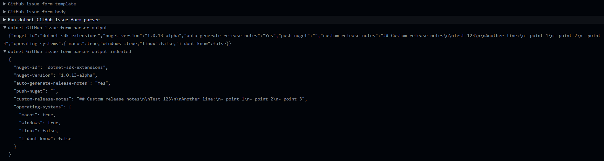

# GitHub issue forms parser

[](https://github.com/edumserrano/github-issue-forms-parser/actions/workflows/build-test.yml)
[](https://codecov.io/gh/edumserrano/github-issue-forms-parser)
[](https://github.com/edumserrano/github-issue-forms-parser/actions/workflows/markdown-link-check.yml)</br>
[](https://github.com/edumserrano/github-issue-forms-parser/actions/workflows/test-action.yml)
[](https://github.com/edumserrano/github-issue-forms-parser/actions/workflows/test-action-gh-marketplace.yml)</br>
[](https://github.com/edumserrano/github-issue-forms-parser/actions/workflows/publish-docker-image.yml)
[](https://github.com/marketplace/actions/github-issue-forms-parser)

[](./LICENSE)
[](https://github.com/sponsors/edumserrano)
[](https://www.linkedin.com/in/eduardomserrano/)

- [Description](#description)
- [Usage](#usage)
- [Action inputs](#action-inputs)
- [Action outputs](#action-outputs)
- [Example output for a given issue form template and body](#example-output-for-a-given-issue-form-template-and-body)
- [Example usages of this action in GitHub workflows](#example-usages-of-this-action-in-github-workflows)
- [I can't figure out the structure of the JSON object produced by the parser](#i-cant-figure-out-the-structure-of-the-json-object-produced-by-the-parser)
- [Dev notes](#dev-notes)

## Description

A Docker container [GitHub action](https://docs.github.com/en/actions/learn-github-actions/finding-and-customizing-actions) that can be used to parse [GitHub issue forms](https://docs.github.com/en/communities/using-templates-to-encourage-useful-issues-and-pull-requests/syntax-for-githubs-form-schema).

## Usage

```yml
- name: Run GitHub issue forms parser
  id: issue-parser
  uses: edumserrano/github-issue-forms-parser@v1
  with:
    template-filepath: '.github/ISSUE_TEMPLATE/my-issue-form-template.yml'
    issue-form-body: '${{ github.event.issue.body }}'
# The next step is using powershell to parse the action's output but you can use whatever you prefer.
# Note that in order to read the step outputs the action step must have an id.
- name: Output parsed issue
  shell: pwsh
  run: |
    $issue = '${{ steps.issue-parser.outputs.parsed-issue }}' | ConvertFrom-Json
    $issueAsJsonIndented = ConvertTo-Json $issue
    Write-Output $issueAsJsonIndented # outputs the parsed issue as an indented JSON string
    ...
```

## Action inputs

| Name | Description | Required
| --- | --- | --- |
| `template-filepath` | The filepath to the [issue form template](https://docs.github.com/en/communities/using-templates-to-encourage-useful-issues-and-pull-requests/configuring-issue-templates-for-your-repository#creating-issue-forms). | yes |
| `issue-form-body` | The body of the issue to parse. | yes |

## Action outputs

| Name | Description
| --- | --- |
| `parsed-issue` | The issue form parsed as a JSON string. |

**Notes about the JSON output:**

- The keys on the JSON object are id field of the template form element.
- Checkboxes form elements are outputed as an object whose keys are the [slugified]((https://blog.tersmitten.nl/slugify/)) value of the label of the option.
- When the form element is optional and no input is provided for the form element then the issue form body will contain a `_No response_` but the parsed output for that key in the JSON string will just be an empty value.
- **For a better understanding of the output rules see example below.**

## Example output for a given issue form template and body

Given the following issue form template:

```yml
name: Release NuGet package
description: Release a NuGet package.
title: Release NuGet package
body:
  - type: markdown
    attributes:
      value: |
        ## Description
        This form is used to release a NuGet package.
  - type: dropdown
    id: nuget-id
    attributes:
      label: What NuGet package do you want to release?
      options:
        - dotnet-sdk-extensions
        - dotnet-sdk-extensions-testing
    validations:
      required: true
  - type: input
    id: nuget-version
    attributes:
      label: What is the new version for the NuGet package?
      description: 'You can create pre-release versions using a suffix. For more info see https://docs.microsoft.com/en-us/nuget/concepts/package-versioning.'
      placeholder: 1.0.0
    validations:
      required: true
  - type: dropdown
    id: auto-generate-release-notes
    attributes:
      label: Auto-generate release notes?
      description: Automatically add the markdown for all the merged pull requests from this diff and contributors of this release.
      options:
        - 'Yes'
        - 'No'
    validations:
      required: true
  - type: dropdown
    id: push-nuget
    attributes:
      label: Push to NuGet.org?
      description: This is optional.
      options:
        - 'Yes'
        - 'No'
  - type: textarea
    id: custom-release-notes
    attributes:
      label: Custom release notes?
      description: This is optional. If filled it will be added at the start of the release notes, before the auto generated release notes.
      placeholder: '## Release notes'
  - type: checkboxes
    id: operating-systems
    attributes:
      label: Which operating systems have you used?
      description: You may select more than one.
      options:
        - label: macOS
        - label: Windows
        - label: Linux
```

And given the following issue form body:

```md
### What NuGet package do you want to release?

dotnet-sdk-extensions

### What is the new version for the NuGet package?

1.0.13-alpha

### Auto-generate release notes?

Yes

### Push to NuGet.org?

_No response_

### Custom release notes?

My custom release notes.

Another line:
- point 1
- point 2
- point 3

### Which operating systems have you used?

- [X] macOS
- [X] Windows
- [ ] Linux
```

The output would be:

```json
{
  "nuget-id": "dotnet-sdk-extensions",
  "nuget-version": "1.0.13-alpha",
  "auto-generate-release-notes": "Yes",
  "push-nuget": "",
  "custom-release-notes": "My custom release notes\n\nAnother line:\n- point 1\n- point 2\n- point 3",
  "operating-systems": {
    "macos": true,
    "windows": true,
    "linux": false,
  }
}
```

## Example usages of this action in GitHub workflows

- [This workflow](https://github.com/edumserrano/github-issue-forms-parser/blob/main/.github/workflows/test-action.yml) is used to test that the action works as expected.
- [This workflow](https://github.com/edumserrano/dot-net-sdk-extensions/blob/33303189c564989fd40fcb1fa5086ca443f7bd92/.github/workflows/nuget-release.yml#L69-L73) shows the usage of the action as part of the release flow of a NuGet package.

## I can't figure out the structure of the JSON object produced by the parser

You can check the structure of the action's output on the log produced by the action.

In the log for the action, expand the groups for `dotnet GitHub issue form parser output` and `dotnet GitHub issue form parser output indented` as shown in the image below.



## Dev notes

For notes aimed at developers working on this repo or just trying to understand it go [here](/docs/dev-notes/README.md). It will show you how to build and run the solution among other things.
